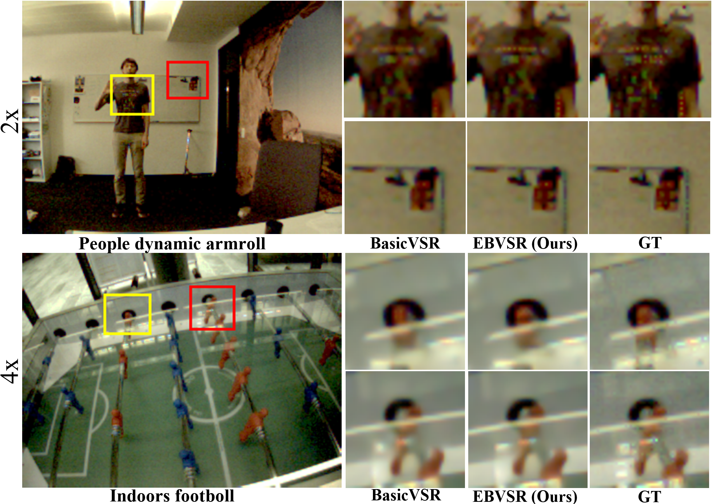

[VIDEO SUPER-RESOLUTION VIA EVENT-DRIVEN TEMPORAL ALIGNMENT](https://ieeexplore.ieee.org/document/10222922) (ICIP 2023)
---
#### Dachun Kai, Yueyi Zhang, Xiaoyan Sun
#### University of Science and Technology of China

#### Abstract
> Video super-resolution aims to improve the quality of low-resolution videos by generating high-resolution versions with better detail and clarity. Existing methods typically rely on optical flow, which assumes linear motion and is sensitive to rapid lighting changes, to capture inter-frame information. Event cameras are a novel type of sensor that output high temporal resolution event streams asynchronously, which can reflect nonlinear motion and are robust to lighting changes. Inspired by these characteristics, we propose an **E**vent-driven **B**idirectional **V**ideo Super-**R**esolution (EBVSR) framework. Firstly, we propose an event-assisted temporal alignment module that utilizes events to generate nonlinear motion to align adjacent frames, complementing flow-based methods. Secondly, we build an event-based frame synthesis module that enhances the network’s robustness to lighting changes through a bidirectional cross-modal fusion design. Experimental results on synthetic and real-world datasets demonstrate the superiority of our method.


### Network Architecture

See [EBVSR_arch.py](basicsr/archs/ebvsr_arch.py).


### Results
<details><summary>Vid4 dataset (Click to expand) </summary>

</details>
<details><summary>CED dataset (Click to expand) </summary>

</details>

### Installation

```
git clone https://github.com/DachunKai/EBVSR
cd EBVSR
pip install -r requirements.txt
python setup.py develop
```

### Dataset

We conducts experiments on both synthetic ([Vid4](https://github.com/YounggjuuChoi/Deep-Video-Super-Resolution/blob/master/Doc/Dataset.md), [Vimeo-90K-T](http://toflow.csail.mit.edu/)) and real-world [CED](https://rpg.ifi.uzh.ch/CED.html) rgb-event well-aligned datasets. For synthetic datasets, we follow the [vid2e](https://github.com/uzh-rpg/rpg_vid2e) event simulator to generate events.

### Pretrained models
Download the pretrained model from this [link](https://drive.google.com/drive/folders/1hb16gTKBCGK2QfjYZJD_WLYHaYPxJ9iT?usp=sharing) and place it to `experiments/pretrained_models/EBVSR/*.pth`.


### Test

```bash
./scripts/dist_test.sh 1 options/test/EBVSR/*.yml
```

### Citations

```
@inproceedings{kai2023video,
  title={Video Super-Resolution Via Event-Driven Temporal Alignment},
  author={Kai, Dachun and Zhang, Yueyi and Sun, Xiaoyan},
  booktitle={2023 IEEE International Conference on Image Processing (ICIP)},
  pages={2950--2954},
  year={2023},
  organization={IEEE}
}
```

### Contact
Should you have any questions, please feel free to contact dachunkai@mail.ustc.edu.cn.


### License and Acknowledgement

This project is under the Apache 2.0 license, and it is based on [BasicSR](https://github.com/xinntao/BasicSR) which is under the Apache 2.0 license. Thanks to the inspirations and codes from [event_utils](https://github.com/TimoStoff/event_utils).